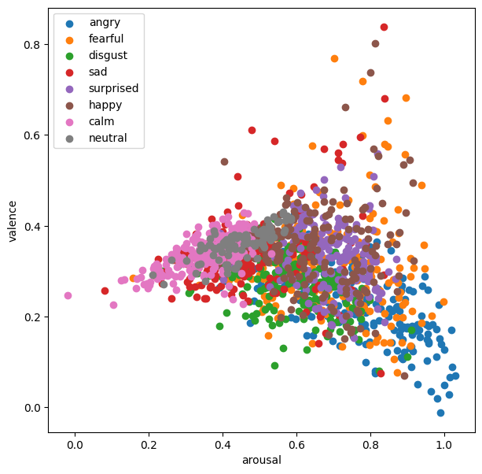
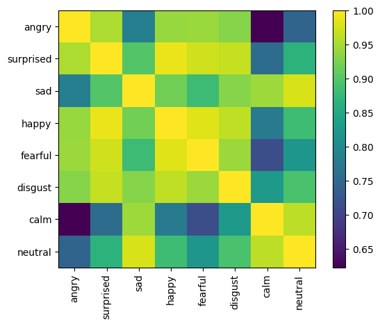

# Speech Emotion Recognition (SER)

We use a SER model to measure the emotion preservation of the anonymization model, by computing the cosine similarity between the emotion embeddings of the original and the anonymized speech. The embeddings are computed with an SER model based on Wav2vec2.0 and fine-tuned on the MSP-Podcast dataset, which has annotated the valence, arousal and dominance dimensions of each sample. You can read more about the SER model in the [HuggingFace page](https://huggingface.co/audeering/wav2vec2-large-robust-12-ft-emotion-msp-dim), and also in the paper cited below.

## Baseline evaluation

We have run this model on the original speech data. The dominance and valence dimensions show some structure regarding dimension labels, but there is a lot of overlap between them. The same can be observed from the cosine similarities between the average emotion embeddings of each category. The calm and neutral categories are further apart from the rest, but the others are all close to each other. Still, the diagonal of the similarity heatmap is the brightest.

### Valence vs. Arousal



### Cosine similarity heatmap

The emotion embeddings are averaged across emotion categories and then compared with one another.



## Citation

```tex
@article{wagner2023dawn,
    title={Dawn of the Transformer Era in Speech Emotion Recognition: Closing the Valence Gap},
    author={Wagner, Johannes and Triantafyllopoulos, Andreas and Wierstorf, Hagen and Schmitt, Maximilian and Burkhardt, Felix and Eyben, Florian and Schuller, Bj{\"o}rn W},
    journal={IEEE Transactions on Pattern Analysis and Machine Intelligence},
    pages={1--13},
    year={2023},
}
```
