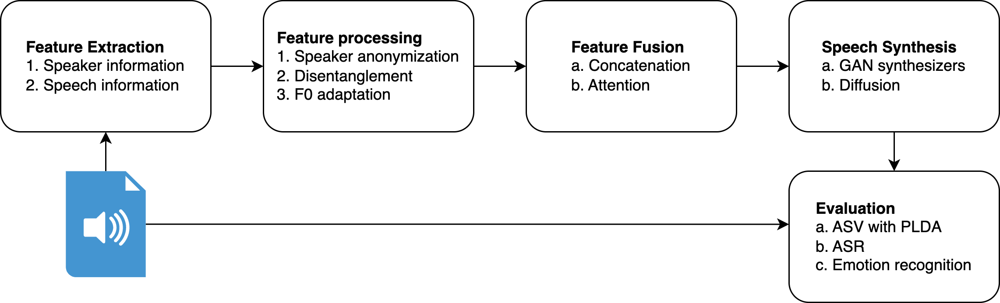

# Speaker Anonymization Framework

Inspired by the [Voice Privacy Challenge](https://github.com/Voice-Privacy-Challenge/Voice-Privacy-Challenge-2022), the goal of this repository is to provide a framework for designing and running experiments for speaker anonymization.

## Design Principles

We have built it following these principles:

1. **Configurable**: each pipeline is defined with a config file (we use YAML files and parse them with [OmegaConf](https://github.com/omry/omegaconf)), which is intuitive and well-documented. It should be easy to design an experiment and it should not require any coding.
2. **Modular**: all components are designed similarly, and can be added or removed from a pipeline through the configuration.
3. **Extendable**: new components can be implemented with ease, following the provided structure.
4. **Reproducible**: the configuration, trained models and results of each experiment are logged with [Weights & Biases](https://wandb.ai/).
5. **Leverage existing libraries**: most of our components come from popular speech processing libraries like [NeMo](https://github.com/NVIDIA/NeMo) and [SpeechBrain](https://github.com/speechbrain/speechbrain).
6. **All Python**: we implement everything in Python, and use PyTorch Lightning to train the anonymization pipeline.

## Architecture

The anonymization pipeline comprises 5 different _modules_, which are in charge of running their assigned _components_ (as defined in the config) and feeding them the appropriate data. Each module is optional has its own purpose:

- **Feature extraction**: receives audio files as input and outputs a dictionary that maps the components to the features they produced.
- **Feature processing**: receives the dictionary with the extracted features and outputs a similar dictionary, where processed features are added to the dictionary and extracted features may be removed.
- **Feature fusion**: receives the dictionary of features and combines them to form the input of the synthesizer.
- **Speech synthesis**: synthesizes its input and stores the anonymized utterances in the experiment folder.
- **Evaluation**: runs several evaluation tasks on the anonymized utterances dumped by the anonymization pipeline. Some evaluation components may also compare the anonymized utterances with the original ones. The evaluation module constitutes its own pipeline, and is run separately from the anonymization pipeline. Read more about the evaluation [here](evaluation.md)

## Datasets

The PyTorch Dataloader used for the anonymization pipeline is based on NeMo's `AudioToSpeechLabelDataset`. The Dataloader requires text files where each line is a JSON object containing the following key-value pairs:

1. `audio_filepath`: path to the audio file (string)
2. `text` (optional): transcript of the audio file (string)
3. `duration`: duration of the audio file in seconds (float)
4. `label`: ID of the audio file's speaker (int)
5. `offset` (optional): time in seconds until the start of the audio snippet (float)

### Creating data files

NeMo offers documentation about its datasets [here](https://docs.nvidia.com/deeplearning/nemo/user-guide/docs/en/stable/asr/speaker_recognition/datasets.html#all-other-datasets). They provide a script to create the data files (which they call _manifest files_), called `filelist_to_manifest.py` ([here](https://github.com/NVIDIA/NeMo/blob/main/scripts/speaker_tasks/filelist_to_manifest.py)). It can be used to create data files from text files that consist of one path to an audio file in each line.

Unfortunately, this script from NeMo does not include the transcript in the data files, which we will often require to perform ASR evaluation. If this is your case as well, we provide our own scripts to create the data files: you can find them in the folder `scripts/create_datafiles`. Currently, we support LibriSpeech, LibriTTS, EdAcc, Common Voice, RAVDESS and VCTK.
